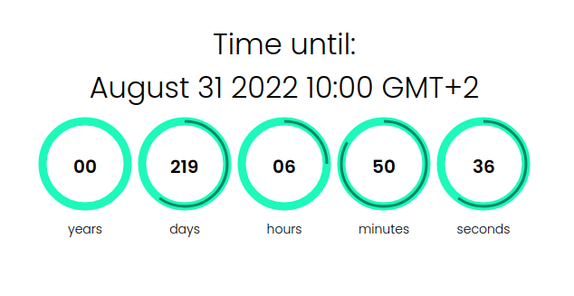

# React Countdown Timer

## 💻 Projeto

Projeto desenvolvido com base no vídeo [React JS Countdown Timer with SVG Animation][video], oferecido por [CodingFromScratch][channel].

## 🛠 Tecnologias

As seguintes tecnologias foram utilizadas no desenvolvimento do projeto:

- [React][react]
- [Sass][sass]
- [Typescript][typescript]

## 📷 Screenshots

<kbd>
  
</kbd>

[channel]: https://www.youtube.com/channel/UCS2UjgEPEybOx1toY7aKRJg
[react]: https://reactjs.org/
[sass]: https://sass-lang.com/
[typescript]: https://www.typescriptlang.org/
[video]: https://www.youtube.com/watch?v=M5kfm3gshwQ
